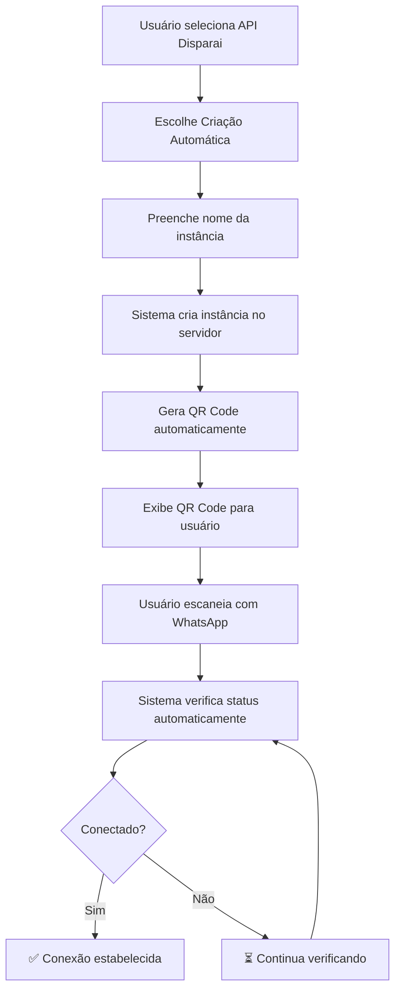

# Configuração Automática de Instâncias WhatsApp

Este documento descreve o sistema de criação automática de instâncias WhatsApp via API Disparai, permitindo que usuários se conectem apenas escaneando um QR Code.

## 🎯 Objetivo

Automatizar completamente o processo de configuração do WhatsApp, eliminando a necessidade de o usuário:
- Criar manualmente uma instância no servidor
- Configurar credenciais complexas
- Gerenciar tokens de acesso

## 🚀 Fluxo de Criação Automática

### 1. Criação da Instância

Quando o usuário seleciona "API Disparai (não oficial)" e escolhe "Criação Automática":

```typescript
// POST /api/disparai/instance
{
  "userId": "user_id",
  "instanceName": "Minha Empresa WhatsApp",
  "webhookUrl": "https://seu-dominio.com/api/disparai/webhook"
}
```

**Resposta:**
```json
{
  "success": true,
  "message": "Instância criada com sucesso",
  "data": {
    "connectionId": "conn_123",
    "instanceKey": "INST_user_123_1640995200",
    "apiToken": "generated_token_here",
    "status": "created",
    "qrCode": "data:image/png;base64,iVBORw0KGgo...",
    "nextStep": "scan_qr"
  }
}
```

### 2. Geração do QR Code

O sistema automaticamente:
- Cria a instância no servidor Disparai
- Gera um QR Code único
- Salva as credenciais no banco de dados
- Exibe o QR Code para o usuário

### 3. Conexão via QR Code

O usuário:
1. Abre o WhatsApp no celular
2. Vai em Menu → Dispositivos conectados
3. Toque em "Conectar um dispositivo"
4. Escaneia o QR Code exibido na tela

### 4. Verificação Automática

O sistema verifica automaticamente a cada 3 segundos se a conexão foi estabelecida:

```typescript
// POST /api/disparai/status
{
  "instanceKey": "INST_user_123_1640995200",
  "userId": "user_id"
}
```

## 🛠️ Componentes Implementados

### 1. AutoInstanceCreator

Componente principal para criação automática:

```tsx
<AutoInstanceCreator
  userId={userId}
  onInstanceCreated={(data) => {
    // Instância criada com sucesso
  }}
  onConnected={() => {
    // WhatsApp conectado
  }}
/>
```

**Funcionalidades:**
- Formulário para nome da instância
- Criação automática no servidor
- Exibição do QR Code
- Verificação de status

### 2. QRCodeConnection

Componente para gerenciar a conexão via QR Code:

```tsx
<QRCodeConnection
  instanceKey={instanceKey}
  userId={userId}
  onConnected={() => {
    // Conexão estabelecida
  }}
/>
```

**Funcionalidades:**
- Exibição do QR Code
- Verificação automática de status
- Renovação do QR Code
- Feedback visual do status

### 3. APIs de Suporte

#### Criação de Instância
- **Endpoint:** `POST /api/disparai/instance`
- **Função:** Criar instância no servidor Disparai
- **Retorna:** Dados da instância e QR Code

#### Verificação de Status
- **Endpoint:** `POST /api/disparai/status`
- **Função:** Verificar se a instância está conectada
- **Retorna:** Status atual da conexão

#### Geração de QR Code
- **Endpoint:** `GET /api/disparai/instance?instanceKey=xxx&userId=xxx`
- **Função:** Gerar novo QR Code se necessário
- **Retorna:** QR Code atualizado

## 📱 Interface do Usuário

### Modal de Nova Conexão

O modal foi atualizado para incluir:

1. **Seleção de Tipo:** WhatsApp Cloud API ou API Disparai
2. **Opção de Criação Automática:** Para API Disparai
3. **Formulário Simplificado:** Apenas nome da instância
4. **QR Code Integrado:** Exibição direta no modal

### Estados Visuais

- **🔄 Aguardando QR Code:** Spinner + instruções
- **📱 QR Code Gerado:** Imagem do QR Code + botão renovar
- **⏳ Aguardando Conexão:** Spinner + verificação automática
- **✅ Conectado:** Ícone de sucesso + confirmação

## 🔧 Integração com Servidor Disparai

### Endpoints Utilizados

Baseado na documentação oficial:

```typescript
// Criar instância
POST https://apibusiness1.megaapi.com.br/rest/instance/create
{
  "instanceName": "string",
  "webhookUrl": "string",
  "qr": true
}

// Gerar QR Code
GET https://apibusiness1.megaapi.com.br/rest/instance/connect/{instanceKey}

// Verificar status
GET https://apibusiness1.megaapi.com.br/rest/instance/{instanceKey}

// Deletar instância
DELETE https://apibusiness1.megaapi.com.br/rest/instance/delete/{instanceKey}
```

### Cliente API Atualizado

```typescript
const client = createDisparaiAPIClient(instanceKey, apiToken);

// Criar instância
const result = await client.createInstance('Minha Empresa', webhookUrl);

// Gerar QR Code
const qrResult = await client.generateQRCode();

// Verificar status
const status = await client.getInstanceStatus();
```

## 🗄️ Banco de Dados

### Tabela api_connections

```sql
CREATE TABLE api_connections (
  id UUID PRIMARY KEY,
  user_id UUID REFERENCES users(id),
  name VARCHAR NOT NULL,
  type VARCHAR NOT NULL, -- 'whatsapp_cloud' ou 'whatsapp_disparai'
  instance_id VARCHAR, -- Instance Key
  api_key VARCHAR, -- Token de acesso
  webhook_url VARCHAR,
  is_active BOOLEAN DEFAULT false,
  status VARCHAR DEFAULT 'created', -- 'created', 'waiting_qr', 'connected', 'error'
  description TEXT,
  created_at TIMESTAMP DEFAULT NOW(),
  updated_at TIMESTAMP DEFAULT NOW()
);
```

### Estados da Conexão

- **`created`:** Instância criada, aguardando QR Code
- **`waiting_qr`:** QR Code gerado, aguardando escaneamento
- **`waiting_connection`:** QR Code escaneado, aguardando conexão
- **`connected`:** WhatsApp conectado com sucesso
- **`error`:** Erro na conexão

## 🔄 Fluxo Completo



## 🎨 Experiência do Usuário

### Antes (Manual)
1. ❌ Criar conta no servidor Disparai
2. ❌ Configurar instância manualmente
3. ❌ Obter credenciais complexas
4. ❌ Configurar webhook
5. ❌ Testar conexão
6. ❌ Gerenciar tokens

### Depois (Automático)
1. ✅ Selecionar "Criação Automática"
2. ✅ Digitar nome da instância
3. ✅ Escanear QR Code
4. ✅ Pronto para usar!

## 🔒 Segurança

### Credenciais
- Tokens são gerados automaticamente pelo servidor
- Credenciais são armazenadas de forma segura no banco
- RLS (Row Level Security) protege dados por usuário

### Validação
- Verificação de autenticação em todas as APIs
- Validação de dados de entrada com Zod
- Tratamento de erros robusto

## 📊 Monitoramento

### Logs Automáticos
- Criação de instâncias
- Geração de QR Codes
- Tentativas de conexão
- Erros e falhas

### Métricas
- Taxa de sucesso na criação
- Tempo médio de conexão
- QR Codes gerados vs conectados
- Instâncias ativas

## 🚀 Próximos Passos

### Quando o Servidor Estiver Disponível

1. **Atualizar URLs:** Trocar URLs de desenvolvimento pelas reais
2. **Configurar Tokens:** Usar tokens reais do servidor
3. **Testar Integração:** Validar todos os endpoints
4. **Monitorar Performance:** Ajustar timeouts e retry logic

### Melhorias Futuras

- [ ] Suporte a múltiplas instâncias por usuário
- [ ] Renovação automática de QR Codes
- [ ] Notificações push para conexão
- [ ] Dashboard de status das instâncias
- [ ] Backup e restore de configurações

## 🆘 Solução de Problemas

### QR Code não aparece
- Verificar se a instância foi criada
- Tentar gerar novo QR Code
- Verificar logs do servidor

### Conexão não estabelece
- Verificar se o WhatsApp está atualizado
- Tentar desconectar outros dispositivos
- Verificar se o QR Code não expirou

### Erro na criação da instância
- Verificar se o servidor está online
- Validar credenciais do servidor
- Verificar logs de erro

## 📚 Referências

- [Documentação API Disparai](https://apibusiness1.megaapi.com.br/docs/)
- [WhatsApp Business API](https://developers.facebook.com/docs/whatsapp)
- [Supabase Documentation](https://supabase.com/docs)
